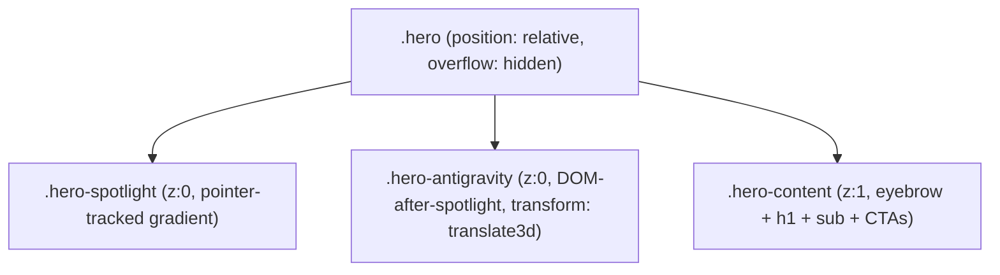
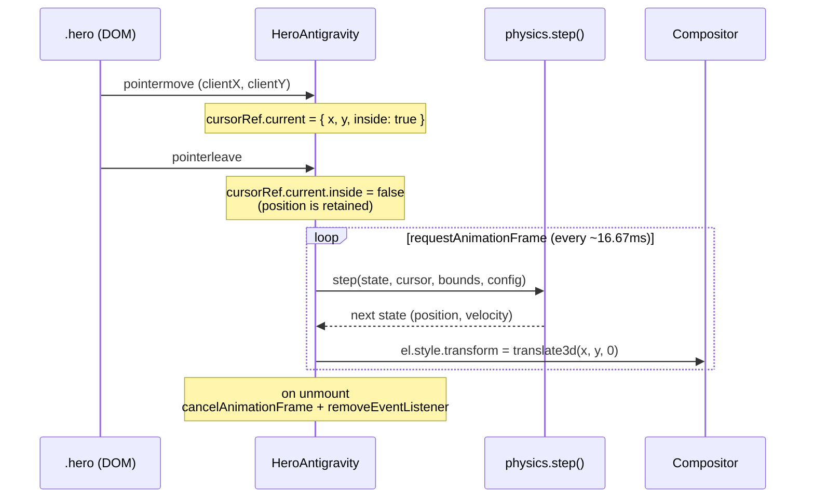
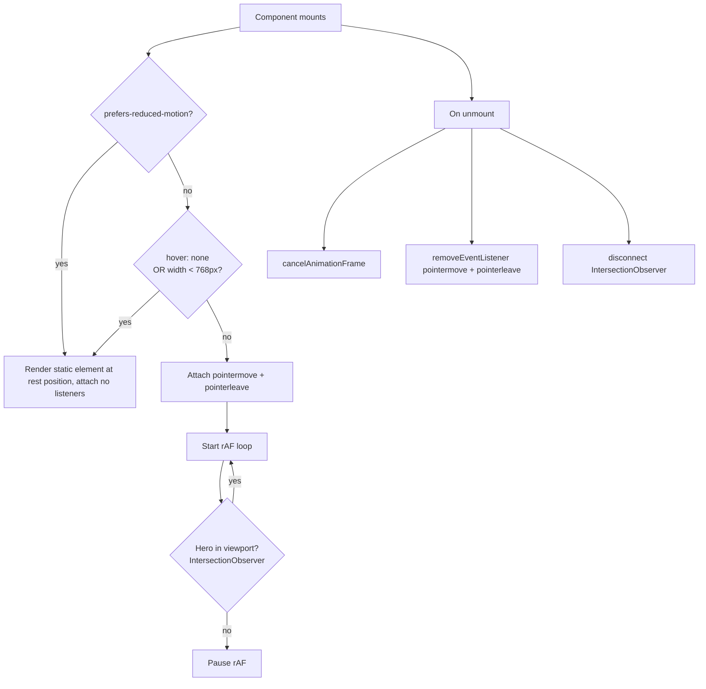

# Design Document

## Overview

`HeroAntigravity` is a client-only decoration that mounts inside `HeroSection` alongside the existing `HeroSpotlight`. Where the spotlight is a stateless cursor-tracked gradient (the gradient *is* the cursor, lagged by a CSS transition), the antigravity layer is the inverse: a small visual mass that *runs away* from the cursor with simulated momentum. The two layers read together as cause and effect — light follows the pointer, matter dodges it.

The implementation is a single React client island plus a pure-TypeScript physics module. The component owns DOM concerns (mount, listeners, `requestAnimationFrame` loop, cleanup, capability gating) and delegates per-frame math (force, integration, damping, clamping, bounce) to side-effect-free functions that can be exhaustively property-tested without a browser. CSS transforms drive positioning so the GPU compositor handles the per-frame paint, never the layout engine.

The element renders above `HeroSpotlight` (z-index stacking via DOM order, both at `z-index: 0`) and below `.hero-content` (`z-index: 1`), so it is always visually behind the headline and CTAs. On `prefers-reduced-motion: reduce`, on touch-primary devices (`hover: none`), and on viewports below 768px, the component short-circuits — either rendering the element in its rest position with no listeners, or returning `null` entirely — so the LCP path on phones and accessibility surfaces is unaffected.

### Design decisions and rationale

- **Pure physics, impure shell**: Splitting the per-frame math out of the React component is what makes the feature testable. A `step(state, cursor, bounds, config) -> state` function is a pure mapping; the React side just calls it 60×/second. This mirrors the codebase's existing pattern of keeping client islands thin.
- **One DOM node, one `transform`**: A single absolutely-positioned `<div>` whose only animated property is `transform: translate3d(x, y, 0)`. No reflows, no repaints of the hero text, no per-frame React state writes. The compositor moves the layer; React never re-renders after mount.
- **`pointermove` on the hero, not on the document**: Same pattern as `HeroSpotlight`. Pointer events outside the hero are not interesting (the element cannot leave the hero), and scoping to the hero element gives us free hit-testing through the rest of the page.
- **Stacking via DOM order, not fractional z-index**: `HeroSpotlight` is z-index 0; `.hero-content` is z-index 1. The new layer sits at z-index 0 too, but is mounted *after* `HeroSpotlight` in the JSX, so the painter's algorithm puts it on top of the spotlight and behind the content. No CSS changes to the existing two layers required.
- **Optional multi-element support is deferred to a single-element default**: Req 9 marks multi-element as `WHERE multiple elements are configured` — i.e. opt-in. The component takes a `count` prop (default 1). The physics module is written for `n` elements from day one so the feature ships with the structure but exposes only the single-element default until visual review.
- **No fractional z-index gymnastics**: see above — DOM order is sufficient.

## Architecture

### Layer composition inside `<HeroSection>`



`Hero` is the bounding box for cursor math and the clipping context for both decoration layers. The painter's algorithm gives the desired stacking order without z-index changes: spotlight, then antigravity, then content.

### Per-frame data flow



State is held in `useRef`, never in `useState`, so the rAF loop runs without ever scheduling a React re-render. The DOM element receives a direct `style.transform` write, sidestepping React's reconciler entirely after mount.

### Lifecycle and capability gates



Mount-time gates match `HeroSpotlight` exactly so the two layers behave consistently: same `prefers-reduced-motion` check, same `hover: none` check, plus a viewport width gate from Req 10.1.

## Components and Interfaces

### File layout

```
src/components/hero/
  HeroSection.tsx           ← existing, mounts the new component conditionally
  HeroSpotlight.tsx         ← existing, unchanged
  HeroAntigravity.tsx       ← new client component (the React shell)
  antigravity-physics.ts    ← new pure module (step, applyRepulsion, clamp, etc.)
```

The physics module is colocated with the component (not in a shared `lib/`) because it is feature-specific — no other surface needs anti-gravity math.

### `HeroAntigravity` (client component)

```tsx
'use client';

export interface HeroAntigravityProps {
  /** Number of independent elements. Default 1. (Req 9) */
  count?: number;
  /** Repulsion radius in CSS pixels. Default 300. (Req 3.1) */
  repulsionRadius?: number;
  /** Repulsion peak strength (force at distance = 0). Default tuned visually. (Req 3.1) */
  repulsionStrength?: number;
  /** Velocity damping factor per frame, [0.85..0.95]. Default 0.92. (Req 3.3) */
  damping?: number;
  /** Maximum velocity magnitude in px/frame. Default 12. (Req 3.4) */
  maxVelocity?: number;
  /** Inset from hero edges in CSS pixels. Default 20. (Req 4.4) */
  edgePadding?: number;
  /** Bounce coefficient applied at boundary collision, (0..1]. Default 0.6. (Req 4.3) */
  bounceCoefficient?: number;
  /** Per-element visual config, indexed up to `count`. (Req 9.4) */
  elements?: ReadonlyArray<HeroAntigravityElementStyle>;
}

export interface HeroAntigravityElementStyle {
  /** CSS pixel diameter. Default 64. */
  size?: number;
  /** CSS color (token-driven preferred). Default `var(--accent)`. */
  color?: string;
  /** Final layer opacity, [0..1]. Default 0.45. */
  opacity?: number;
}

export function HeroAntigravity(props: HeroAntigravityProps): JSX.Element | null;
```

Internally the component owns:

| Ref | Type | Purpose |
| --- | --- | --- |
| `containerRef` | `RefObject<HTMLDivElement>` | The wrapper `<div>` whose `parentElement` is `.hero`. |
| `elementRefs` | `RefObject<(HTMLDivElement \| null)[]>` | One DOM node per simulated mass, written via `style.transform`. |
| `stateRef` | `RefObject<PhysicsState>` | Live position + velocity for every element; mutated in place by the rAF loop. |
| `cursorRef` | `RefObject<CursorState>` | Last known cursor position and an `inside` flag. |
| `boundsRef` | `RefObject<Bounds>` | Cached `getBoundingClientRect()` of `.hero`, refreshed on `resize` and on rAF start. |
| `frameRef` | `RefObject<number>` | The current `requestAnimationFrame` handle, used for cleanup. |

The component returns `null` when the viewport-width gate fires (Req 10.1) so the DOM contains no antigravity nodes on phones at all. It returns the static-position fallback (no listeners, no rAF) for `prefers-reduced-motion` and `hover: none` so accessibility-conscious and touch-only users see the visual without the motion (Req 7.1, 7.2).

### `antigravity-physics.ts` (pure module)

All exports are pure functions with no DOM access, no `Math.random`, no time references — every input is passed in.

```ts
export interface Vec2 { readonly x: number; readonly y: number; }

export interface Particle {
  readonly position: Vec2;
  readonly velocity: Vec2;
}

export interface PhysicsState {
  readonly particles: ReadonlyArray<Particle>;
}

export interface CursorState {
  readonly position: Vec2;
  readonly inside: boolean;
}

export interface Bounds {
  /** Min x in local hero coordinates (= edgePadding). */
  readonly minX: number;
  /** Max x in local hero coordinates (= heroWidth - edgePadding - elementSize). */
  readonly maxX: number;
  readonly minY: number;
  readonly maxY: number;
}

export interface PhysicsConfig {
  readonly repulsionRadius: number;
  readonly repulsionStrength: number;
  readonly damping: number;       // [0..1)
  readonly maxVelocity: number;   // > 0
  readonly bounceCoefficient: number; // (0..1]
}

/** Compute the repulsion force on a particle from a cursor. Zero when
 *  cursor is outside the radius or coincident with the particle. */
export function repulsion(
  particle: Vec2,
  cursor: Vec2,
  radius: number,
  strength: number,
): Vec2;

/** Cap a vector's magnitude at `max`. Returns the input if already within. */
export function clampVelocity(velocity: Vec2, max: number): Vec2;

/** Constrain a position to bounds and reflect velocity at any axis that hit. */
export function applyBoundary(
  particle: Particle,
  bounds: Bounds,
  bounceCoefficient: number,
): Particle;

/** One Euler integration step:
 *    velocity' = clamp((velocity + force) * damping, maxVelocity)
 *    position' = bounds(position + velocity')
 *  Force is the cursor repulsion only (gravity = 0).
 */
export function stepParticle(
  particle: Particle,
  cursor: CursorState,
  bounds: Bounds,
  config: PhysicsConfig,
): Particle;

/** Multi-particle step: each particle integrates against the cursor and,
 *  if there are siblings, against an inter-element repulsion (Req 9.2). */
export function step(
  state: PhysicsState,
  cursor: CursorState,
  bounds: Bounds,
  config: PhysicsConfig,
): PhysicsState;
```

The `step` function never throws and always returns a state with the same number of particles as the input. All numeric outputs are finite for any finite input — the design treats `NaN`/`Infinity` as illegal inputs that the caller must screen, which the React layer guarantees by validating the cached `Bounds` before passing them in.

### Integration with `HeroSection`

`HeroSection.tsx` adds an optional `antigravity` prop that mirrors the existing `spotlight` prop pattern:

```tsx
export type HeroSectionProps = {
  // …existing fields
  spotlight?: boolean;
  antigravity?: boolean | HeroAntigravityProps; // new
};
```

When `antigravity` is `true`, the component mounts `<HeroAntigravity />` with defaults. When it is an object, the object is forwarded as props. When it is `false`/`undefined`, nothing renders — the client bundle is not even imported on routes that omit the prop, matching the spotlight scoping pattern (Req 8.2).

The mount sits between `<HeroSpotlight />` and `<div className="hero-content">` so DOM order produces the desired stacking.

```tsx
{spotlight ? <HeroSpotlight /> : null}
{antigravity ? (
  <HeroAntigravity {...(typeof antigravity === 'object' ? antigravity : {})} />
) : null}
<div className="hero-content">…</div>
```

The home page (`src/app/page.tsx`) flips both flags on:

```tsx
<HeroSection … spotlight antigravity />
```

### CSS additions in `globals.css`

Two new rules, scoped under the existing `.hero` block:

```css
/* Wrapper sits at z:0 like the spotlight; DOM order pushes it above. */
.hero-antigravity {
  position: absolute;
  inset: 0;
  pointer-events: none;
  z-index: 0;
  overflow: hidden;
}

/* Each particle. Position is owned by JS via translate3d. */
.hero-antigravity .hero-antigravity__el {
  position: absolute;
  top: 0;
  left: 0;
  border-radius: 50%;
  background: radial-gradient(
    circle at 35% 35%,
    color-mix(in oklch, var(--accent) 90%, transparent),
    color-mix(in oklch, var(--accent) 40%, transparent) 60%,
    transparent 75%
  );
  filter: blur(8px);
  opacity: 0.45;
  /* Hint to the compositor: only transform changes, never layout. */
  will-change: transform;
  transform: translate3d(0, 0, 0);
}

@media (prefers-reduced-motion: reduce) {
  .hero-antigravity .hero-antigravity__el {
    /* Static rest position is set inline via JS once at mount. The blur
       and opacity are kept so the visual still matches the design. */
    will-change: auto;
  }
}
```

`color-mix` and `var(--accent)` keep the visual on the design system token (Req 6.1); the soft `blur(8px)` plus `opacity: 0.45` produces the subtle, non-distracting appearance Req 6.2 calls for; the radial gradient gives the mass a 3D feel that reads cleanly against the spotlight wash (Req 6.3).

## Data Models

### `Vec2`

A pure 2D vector. Immutable. Every physics function returns a new `Vec2` rather than mutating; the React layer dereferences `.x` / `.y` once per frame to write the `transform` string.

```ts
interface Vec2 {
  readonly x: number; // CSS pixels in hero-local coordinates
  readonly y: number;
}
```

### `Particle`

One simulated mass: a position and a velocity, both `Vec2`. Position is in hero-local pixel coordinates (origin at `.hero` top-left). Velocity is in pixels-per-frame at 60 FPS — fixed-step integration assumes a 16.67 ms frame; the React loop does not rescale by `deltaTime` because rAF on healthy devices produces ~constant frame time and the design tolerates minor timing drift.

```ts
interface Particle {
  readonly position: Vec2;
  readonly velocity: Vec2;
}
```

### `PhysicsState`

The full simulation state. An ordered tuple of `Particle`s — order is significant because the React layer pairs `state.particles[i]` with `elementRefs.current[i]`.

```ts
interface PhysicsState {
  readonly particles: ReadonlyArray<Particle>;
}
```

### `CursorState`

Cursor position plus an `inside` flag. When `inside` is `false` the physics module emits zero repulsion force, so the particles coast to a stop under damping (Req 3.5). The flag is what lets the component honor Req 2.3 (cursor outside viewport → element retains last position) without storing a stale "last seen" time.

```ts
interface CursorState {
  readonly position: Vec2;
  readonly inside: boolean;
}
```

### `Bounds`

Pre-computed clamp limits in hero-local coordinates. The React layer subtracts both the edge padding (Req 4.4) and the per-element size up front so the physics module can clamp directly without knowing about element radius:

```ts
interface Bounds {
  readonly minX: number; // = edgePadding
  readonly maxX: number; // = heroWidth - edgePadding - elementSize
  readonly minY: number; // = edgePadding
  readonly maxY: number; // = heroHeight - edgePadding - elementSize
}
```

The component recomputes `Bounds` on `resize` and again on every rAF tick that finds the hero rectangle has changed (defensive — `ResizeObserver` is the primary signal, the per-tick check catches edge cases like devtools opening).

### `PhysicsConfig`

The tuning knobs from Req 3 and Req 4, bundled. Defaults are baked into the React component and forwarded; the physics module receives them per call so it stays pure.

```ts
interface PhysicsConfig {
  readonly repulsionRadius: number;     // px,  default 300
  readonly repulsionStrength: number;   // unitless, tuned
  readonly damping: number;             // [0.85..0.95], default 0.92
  readonly maxVelocity: number;         // px/frame, default 12
  readonly bounceCoefficient: number;   // (0..1], default 0.6
}
```


## Correctness Properties

*A property is a characteristic or behavior that should hold true across all valid executions of a system — essentially, a formal statement about what the system should do. Properties serve as the bridge between human-readable specifications and machine-verifiable correctness guarantees.*

The properties below target the pure physics module (`antigravity-physics.ts`). The React shell is exercised via example/integration tests (see Testing Strategy) — its behaviors (rAF wiring, listener cleanup, capability gates) are not universally quantified over input space and therefore not PBT-shaped.

### Property 1: Cursor outside has no influence on the step function

*For any* `PhysicsState` `s`, any `Bounds` `b`, any valid `PhysicsConfig` `c`, and any two cursor positions `p1` and `p2` paired with `inside: false`, the result of `step(s, { position: p1, inside: false }, b, c)` equals `step(s, { position: p2, inside: false }, b, c)`.

**Validates: Requirements 2.3**

### Property 2: Repulsion is directional, monotonic, and bounded by radius

*For any* particle position `q` and cursor position `p` with `q !== p`, given radius `r > 0` and strength `k > 0`, `repulsion(q, p, r, k)` satisfies:

- if `distance(q, p) >= r`, the force is the zero vector;
- if `distance(q, p) < r`, the force vector points strictly away from the cursor (`force · (q - p) > 0`);
- if `0 < d1 < d2 < r` for two distances measured at the same direction, `magnitude(repulsion at d1) > magnitude(repulsion at d2)`.

**Validates: Requirements 3.1**

### Property 3: Velocity delta direction matches force direction

*For any* `Particle` `pt` and `CursorState` `cs` with `cs.inside === true` and `distance(pt.position, cs.position) > 0`, given the same `Bounds` and `PhysicsConfig`, the velocity change `step(...).velocity - pt.velocity` projected onto the unit force direction is non-negative — i.e. the force pushes velocity in the away-from-cursor direction, never against it.

**Validates: Requirements 3.2**

### Property 4: Damping reduces velocity magnitude in the absence of force

*For any* `Particle` `pt`, any `Bounds` `b` such that `pt.position` is strictly interior with margin greater than `maxVelocity`, any `PhysicsConfig` `c` with `0 < c.damping < 1`, and a `CursorState` with `inside: false`, the next velocity satisfies `magnitude(step(...).velocity) <= magnitude(pt.velocity) * c.damping + epsilon` for floating-point epsilon.

**Validates: Requirements 3.3**

### Property 5: Velocity magnitude never exceeds the configured cap

*For any* `PhysicsState` `s`, any `CursorState`, any `Bounds`, and any valid `PhysicsConfig` `c`, every particle in `step(s, …, c).particles` has `magnitude(velocity) <= c.maxVelocity` (within floating-point epsilon).

**Validates: Requirements 3.4**

### Property 6: Interior position integration equals position plus velocity

*For any* `Particle` `pt` whose position is strictly interior with margin greater than `maxVelocity` from every boundary, any `CursorState` whose distance from `pt.position` exceeds `repulsionRadius` (so the force is zero), and any valid config: `step(...).position === pt.position + step(...).velocity` (component-wise, within floating-point epsilon).

**Validates: Requirements 3.6**

### Property 7: Position is always within bounds

*For any* `PhysicsState`, any `CursorState`, any `Bounds` `b` with `b.minX < b.maxX` and `b.minY < b.maxY`, and any valid `PhysicsConfig`, every particle in `step(...).particles` has `b.minX <= position.x <= b.maxX` and `b.minY <= position.y <= b.maxY`.

**Validates: Requirements 4.1, 4.2, 4.4**

### Property 8: Boundary collisions reflect and dampen the perpendicular velocity component

*For any* `Particle` `pt`, `Bounds` `b`, and config `c`, if the unbounded next position `pt.position + step(...).velocity_unbounded` would land outside `b` on a given axis, then on that axis the resulting `step(...).velocity` has the opposite sign of the pre-bounce velocity (or is zero) and `magnitude(velocity_axis_after) <= magnitude(velocity_axis_before) * c.bounceCoefficient`.

**Validates: Requirements 4.3**

### Property 9: Per-particle update isolates non-interacting particles

*For any* `PhysicsState` `s` with at least two particles where particle `i` and particle `j` are separated by more than the inter-element repulsion radius, `step(s, …).particles[i]` equals `step(removeParticle(s, j), …).particles[i]`.

**Validates: Requirements 9.1**

## Error Handling

The physics layer treats invalid inputs as caller bugs and the React layer as the single source of truth for input validation. The component will not panic on a malformed prop — it falls back to defaults — but it will refuse to operate on a malformed runtime environment.

### Invalid prop values

| Prop | Validation | Behavior on violation |
| --- | --- | --- |
| `count` | integer in `[1..16]` | Clamped to range; logs a `console.warn` in development. |
| `repulsionRadius` | finite positive number | Falls back to default (300). |
| `repulsionStrength` | finite positive number | Falls back to default. |
| `damping` | finite, `[0.5..0.999]` (the requirement says `[0.85..0.95]` for the visual band; we accept the wider range to allow tuning) | Clamped; warns in development. |
| `maxVelocity` | finite positive number | Falls back to default (12). |
| `edgePadding` | finite non-negative number | Clamped to non-negative; falls back to default (20) on `NaN`. |
| `bounceCoefficient` | finite, `(0..1]` | Clamped. |
| `elements[i].opacity` | finite, `[0..1]` | Clamped. |
| `elements[i].size` | finite, `(0..256]` | Clamped. |

The React component does this normalization once at mount inside a `useMemo`, so the rAF loop sees clean numbers and the physics module's invariants hold.

### Degenerate runtime states

- **Hero element not found**: if `containerRef.current?.parentElement` is null at mount, the component bails — no listeners attached, no rAF scheduled. Same defensive pattern as `HeroSpotlight`.
- **Hero rectangle has zero width or zero height**: the rAF tick that observes `rect.width === 0 || rect.height === 0` skips the step (no math, no DOM write) and tries again next frame. This handles the `display: none` race during route transitions and the brief zero-sized state on iOS during orientation change.
- **`requestAnimationFrame` unavailable** (SSR): the entire effect body is gated on `typeof window !== 'undefined'`. The component still mounts — it just renders the static element — so SSR markup matches CSR markup.
- **`IntersectionObserver` unavailable**: if missing (old browsers, SSR), the component falls back to running the rAF loop unconditionally. The performance hit on out-of-view scrolling is acceptable; the alternative is no animation at all.
- **`matchMedia` unavailable**: defensively checked. Treated as if neither gate fires (so the animation runs).

### Numerical edge cases (covered by Property generators)

- **Cursor coincident with particle**: `distance === 0`. The `repulsion` function returns the zero vector rather than dividing by zero. Document this in the function's contract; the property test for P2 explicitly excludes `q === p` from the universal quantification because the direction is undefined there.
- **Very small distances**: the inverse-distance formula uses `1 / max(distance, 1)` to avoid runaway forces when the cursor is microscopically close. The property test for P5 (velocity magnitude bound) is what verifies that this clamp prevents force explosion from violating the cap.
- **Bounds inverted** (`minX > maxX`): the React layer recomputes bounds whenever the rect changes, but never produces inverted ones (it clamps to non-negative dimensions first). The physics module's invariant is "given valid bounds, output is in bounds" — invalid bounds are out of contract.

### Cleanup contract

On unmount, the component must:

1. `cancelAnimationFrame(frameRef.current)` if a frame is scheduled.
2. `removeEventListener` for both `pointermove` and `pointerleave` from the hero element.
3. `disconnect()` the `IntersectionObserver` and the `ResizeObserver`.
4. Set all refs to `null` so the next mount starts clean.

Failure to clean up listeners is the most common source of memory leaks in long-lived SPAs; this list mirrors `HeroSpotlight`'s cleanup contract exactly so the review surface is small.

## Testing Strategy

### Tooling

The project does not yet have a test runner installed (`package.json` has no test script and no testing dependencies). This feature introduces:

- **Vitest** as the runner — chosen because it integrates cleanly with the existing TypeScript+ESM toolchain, runs in jsdom for component tests and node for pure-function tests, and is the de-facto Next.js companion runner.
- **fast-check** for property-based testing — chosen because it is the standard PBT library for the JS/TS ecosystem, has first-class TypeScript types, and integrates with Vitest via `it.prop` for inline property tests.
- **@testing-library/react** + **@testing-library/user-event** for React component example tests.
- **jsdom** environment for component tests.

These are dev dependencies only; nothing ships to the browser.

### Test layers

There are three layers, each with a distinct responsibility:

1. **Property tests** (pure, fast, exhaustive) — `antigravity-physics.test.ts`. One property-based test per Correctness Property (P1–P9). Each runs at minimum 100 iterations via fast-check's default. Each test is annotated with a comment in the format `// Feature: hero-cursor-antigravity, Property N: <text>`.

2. **Unit / example tests** (also in `antigravity-physics.test.ts`) — concrete cases that pin specific numeric outputs:
   - `repulsion(particle, particle, …)` returns `(0, 0)`.
   - `clampVelocity({x: 100, y: 0}, 10)` returns `{x: 10, y: 0}`.
   - `applyBoundary` with a particle exactly on the boundary leaves it on the boundary, with velocity component zeroed.
   - `step` with all defaults and a single particle at center, cursor at corner, produces a vector pointing toward the opposite corner.

3. **Component tests** (`HeroAntigravity.test.tsx`) — example tests covering the React shell. These do *not* re-test the physics; they verify wiring:
   - Mounts inside `<HeroSection>` and renders `count` element nodes (1.1, 1.2).
   - The element wrapper has `aria-hidden="true"` and `pointer-events: none` (7.3, 7.4).
   - `requestAnimationFrame` is invoked after mount (2.4).
   - When `matchMedia('(prefers-reduced-motion: reduce)')` returns `matches: true`, no `pointermove` listener is registered (7.1, 7.2).
   - When `matchMedia('(hover: none)')` returns `matches: true`, no listeners are registered.
   - When `window.innerWidth < 768`, the component returns `null` (10.1).
   - On unmount, `cancelAnimationFrame` is called and listeners are removed (5.5).
   - The element's inline style after the first frame contains a `transform: translate3d(...)` declaration — never `top` or `left` (1.4).
   - With `var(--accent)` in scope, the rendered element's gradient references the token (6.1).

### Property test conventions

- Each property test runs **at least 100 iterations** (fast-check default `numRuns: 100`).
- Each property test is tagged with the feature name and property number/text:

  ```ts
  // Feature: hero-cursor-antigravity, Property 5: |velocity_next| <= maxVelocity
  it.prop([validParticleArb, validCursorArb, validBoundsArb, validConfigArb])(
    'velocity magnitude never exceeds the configured cap',
    (particle, cursor, bounds, config) => {
      const next = stepParticle(particle, cursor, bounds, config);
      expect(magnitude(next.velocity)).toBeLessThanOrEqual(
        config.maxVelocity + EPSILON,
      );
    },
  );
  ```

- **Generators** (Arbitraries) live in `antigravity-physics.test.ts` next to the tests:
  - `validParticleArb`: position with finite x, y in `[-1000..2000]`; velocity finite in `[-50..50]` (allows velocities above maxVelocity to provoke the cap).
  - `validCursorArb`: position finite in viewport range; `inside` boolean.
  - `validBoundsArb`: generates `{minX, minY}` then a positive `width`/`height` so `maxX > minX`, `maxY > minY` always.
  - `validConfigArb`: `repulsionRadius` in `[50..500]`, `repulsionStrength` in `[1..1000]`, `damping` in `[0.5..0.999]`, `maxVelocity` in `[1..50]`, `bounceCoefficient` in `(0.01..1]`.

- **Edge case coverage in generators**: the cursor generator includes a small probability of coincident-position with the particle (covered by P2's exclusion clause). The bounds generator includes very narrow bounds (height=1px) so the boundary properties stress-test the bounce path. The particle generator includes positions slightly outside bounds so the clamp path is exercised.

### Why no PBT for the React shell

The React shell does I/O — listener registration, rAF scheduling, DOM property writes. None of these have a meaningful "for all inputs" framing:

- "For all `pointermove` events, the cursor ref updates" reduces to "the listener is registered" — an example test.
- "For all unmounts, `cancelAnimationFrame` is called" reduces to one test.

PBT would be misapplied here. The example-tests layer covers it correctly.

### Performance verification

Req 5.3 (≤16 ms per frame) and Req 9.3 (≥30 FPS with multiple elements) are environment-dependent and not framed as properties. Coverage is a single benchmark test that runs `step` 10,000 times with `count=8` and asserts the total wall-clock time is below a generous bound (e.g., 100 ms total). This is a smoke-style guard against algorithmic regressions, not a per-frame guarantee.

### Test commands

A `test` script is added to `package.json`:

```json
"scripts": {
  "test": "vitest --run",
  "test:watch": "vitest"
}
```

CI runs `npm run test` (single execution, no watch mode).
